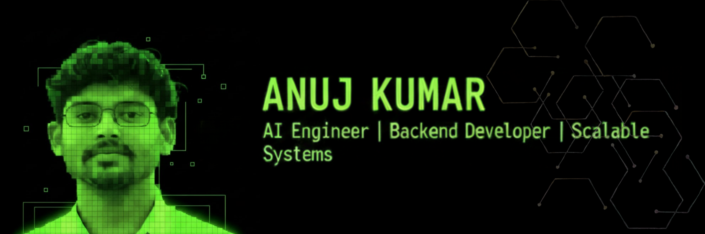

<!-- PROFILE BANNER -->

  

<!-- TYPING ANIMATION -->

  

---

## 💫 About Me
👋 Hi, I’m **Anuj Kumar**, a **B.Tech Computer Science & Engineering student at KIIT Bhubaneswar**.  
I specialize in **AI-driven applications, backend development, and scalable system design**.

🔹 Strong foundation in **Machine Learning, NLP, and Data Analysis**  
🔹 Hands-on experience building **RAG systems, AI agents, and backend APIs**  
🔹 Passionate about solving **real-world problems using AI and software engineering**

🎯 **Actively seeking internships & opportunities** in:
- AI / ML Engineering  
- Backend / Software Development  
- Data & Applied AI Roles  

---

## 🚀 Featured Projects (Recruiter Highlight)

### 🧠 Deep Research Assistant (AI Multi-Agent System)
**Tech:** Python · FastAPI · LangChain · LangGraph · LlamaIndex · Selenium · React  
- Built a **multi-agent AI research system** with autonomous planning, scraping, retrieval & report generation  
- Implemented **Hybrid RAG (Vector + BM25)** for evidence-backed outputs  
- Designed agent workflow: **Planner → Researcher → Writer → Visualizer**

🔗 *Private / Demo on request*

---

### 📚 StudyMate – AI Academic Assistant
**Tech:** Python · FastAPI · FAISS · GPT · Gemini  
- Developed a **Retrieval-Augmented Generation (RAG)** system for academic queries  
- Reduced query response time by **40%**  
- Achieved **90%+ accuracy** in topic-based responses  
- Presented to faculty review panel

🔗 *Repo available*

---

### 📰 Fake News Classifier (NLP + ML)
**Tech:** Python · Scikit-learn · NLP · BERT · Streamlit  
- Built ML & Transformer models achieving **92% accuracy**  
- Implemented full NLP pipeline: preprocessing, vectorization & evaluation  
- Deployed interactive **Streamlit web app**

🔗 *Repo available*

---

## 🧠 AI / ML Skill Set

**Machine Learning**
- Supervised & Unsupervised Learning  
- Model Evaluation & Feature Engineering  

**Natural Language Processing**
- TF-IDF · Word Embeddings · Transformers  
- Text Classification · Information Retrieval  

**AI Systems**
- RAG Pipelines (FAISS, LlamaIndex)  
- AI Agents & Workflow Orchestration  
- Prompt Engineering  

---

## 💻 Tech Stack

### 👨‍💻 Languages

### ⚙️ Frameworks & Tools

### 📊 Data & ML

---

## 🌐 Connect With Me

  
  
  

---

## 📊 GitHub Stats

  
  

---

## ✍️ Dev Quote

  

---

  

✨ Thanks for visiting — let’s build intelligent systems together ✨

